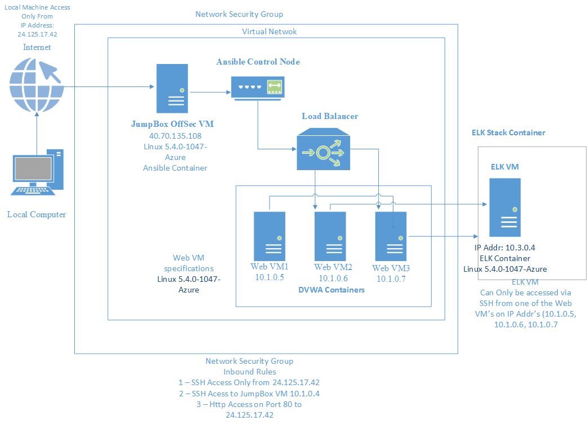

## Automated ELK Stack Deployment

The files in this repository were used to configure the network depicted below.

These files have been tested and used to generate a live ELK deployment on Azure. They can be used to either recreate the entire deployment pictured above. Alternatively, select portions of the filebeat-playbook.yml file may be used to install only certain pieces of it, such as Filebeat.

This document contains the following details:
- Description of the Topology
- Access Policies
- ELK Configuration
  - Beats in Use
  - Machines Being Monitored
- How to Use the Ansible Build

### Description of the Topology

The main purpose of this network is to expose a load-balanced and monitored instance of DVWA, the D*mn Vulnerable Web Application.

Load balancing ensures that the application will be highly REDUNDANT, in addition to restricting TRAFFIC to the network.

What aspect of security do load balancers protect? 

        Answer: Load Balancers distribute network traffic across multiple VM's, thereby protecting against DDOS attacks
                                  
What is the advantage of a jump box?

        Answer: It restricts access or reduces traffic to the VM's running the Web Applications.

Integrating an ELK server allows users to easily monitor the vulnerable VMs for changes to the _____ and system _____.

   What does Filebeat watch for? File system

   What does Metricbeat record?  Machine metrics

The configuration details of each machine may be found below.

| Name     | Function   | IP Address | Operating System |
|----------|------------|------------|------------------|
| Jump Box | Gateway    | 10.1.0.4   | Linux            |
| Web-1    | Web Server | 10.1.0.5   | Linux            |
| Web-2    | Web Server | 10.1.0.6   | Linux            |
| Web-3    | Web Server | 10.1.0.7   | Linux            |

### Access Policies

The machines on the internal network are not exposed to the public Internet. 

Only the Jump-Box machine can accept connections from the Internet. Access to this machine is only allowed from the following IP addresses:

         Add whitelisted IP addresses - 40.70.135.108 (JumpBox Public IP)

Which machine did you allow to access your ELK VM? What was its IP address?

         The ELK VM is only accessible from the ansible container running on the JumpBox VM.
         IP Address - 10.1.0.4 Private IP Addr 

A summary of the access policies in place can be found in the table below.

| Name     | Publicly Accessible | Allowed IP Addresses            |
|----------|---------------------|---------------------------------|
| Jump Box |        Yes          |    40.70.135.108                |
| Web-1    |        No           |    10.1.0.5                     |
| Web-2    |        No           |    10.1.0.6                     |
| Web-3    |        No           |    10.1.0.7                     |
| Elk-VM   |        No           |    10.1.0.5, 10.1.0.6, 10.1.0.7 |

### Elk Configuration

Ansible was used to automate configuration of the ELK machine. No configuration was performed manually, which is advantageous because...

What is the main advantage of automating configuration with Ansible?_

      Answr - The main advantage of automating configuration with Ansible is
              the ease of configuring Standardized VM across one or more VM's.

The playbook implements the following tasks:

- In 3-5 bullets, explain the steps of the ELK installation playbook. 

        - Install Docker (docker.io) high-level API, which contains the core docker      components
        - Install Python3
        - Increase Virtual Memory
        - Download and launch the docker elk container
        - Start Docker

The following screenshot displays the result of running `docker ps` after successfully configuring the ELK instance.

### Target Machines & Beats
This ELK server is configured to monitor the following machines:

    - List the IP addresses of the machines you are monitoring
          - 10.1.0.5 Web VM-1
          - 10.1.0.6 Web VM-2
          - 10.1.0.7 Web VM-3

We have installed the following Beats on these machines:

- Specify which Beats you successfully installed

      Answer - Filebeat

These Beats allow us to collect the following information from each machine:

- In 1-2 sentences, explain what kind of data each beat collects, and provide         1 example of what you expect to see. E.g., `Winlogbeat` collects Windows logs, which we use to track user logon events, etc._

    Answr - Filebeat is responsible for monitoring log files or user-specified events, as well as collecting log events on the installed servers and sending that info to Elasticsearch or Logstash.

### Using the Playbook
In order to use the playbook, you will need to have an Ansible control node already configured. Assuming you have such a control node provisioned: 

SSH into the control node and follow the steps below:
- Copy the _____ file to _____.
- Update the _____ file to include...
- Run the playbook, and navigate to ____ to check that the installation worked as expected.

Answer the following questions to fill in the blanks:_

- _Which file is the playbook? Where do you copy it?_

        - OffSecyaml.yml is the name of the playbook
        - Copy it to the ansible roles directory

- _Which file do you update to make Ansible run the playbook on a specific machine? How do I specify which machine to install the ELK server on versus which to install Filebeat on?_

        - The host file contains the IP Addresses of the installation machines

        - You would create separate group tags for each server in question. For example [Elk] for the machine on which the ELK Server is to be installed and [webservers] for the machines on which to install filebeat.

- _Which URL do you navigate to in order to check that the ELK server is running?

        - Navigate to the kibana page running on the ELK VM. The URL is: 

          [Elk VM Public IP]:5601/app/kibana#/home

